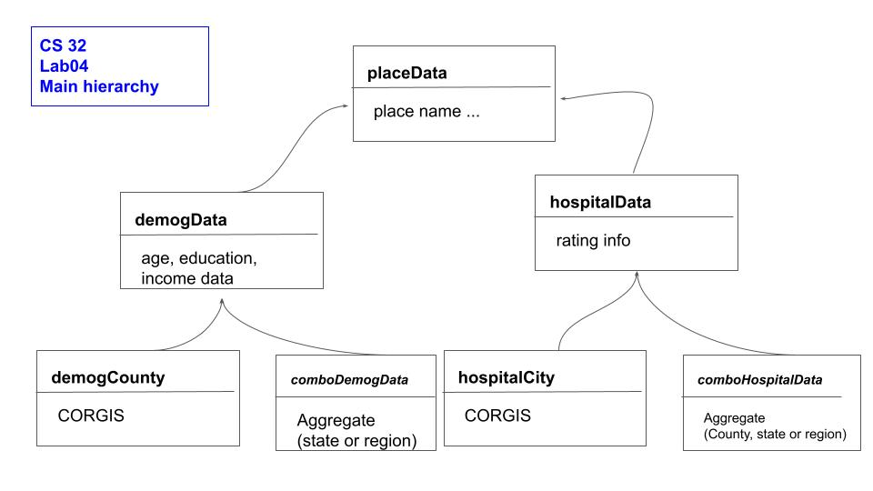

Goals
=====

Learning objectives. At the end of this lab, students should be able to:

-  Revise and modify the implementation of existing code to lift shared data and members to parent class(es) (implement inheritance to simplify our existing code base)
-  Reduce redundancy in code by using inheritance (including re-write parse.cpp to reduce redundant type dependent portions)
-  Use inheritance to design types (without redundancy) to aggregate data to correct regional level ( in addition to the code to aggregate to state level also use STL and city->county hashmap to create 'county' level hospital data)
-  Use new county level hospital data to compare county hospital data to county demographic data


Orientation
============
At this point, we have a healthy amount of code (most of your lab03 solutions are over 1K lines of code -- which is still a very small software project, but 
is growing in complexity).  Assuming we would like to add yet another data source to build up more information in our software, it is worth taking a moment now
to reflect on the code we have and how to *simplify* that code.  The `spirit of the problem' for this assignment is the use of inheritance.

Good questions to consider are: <br>
-Where is there redundancy in my code?<br>
-What data is repeated or very similar? (that could potentially be simplified)<br>
-Where are there unique differences that must be preserved.

There are many ways we could re-write our current project, however, we will ask you to mostly follow a specific re-structuring, but we hope that this 
process allows you to explore the tools of OO (inheritance and polymorphism) and in general to think about design.

To motivate this re-structuring, look at parse.cpp for example, there are two functions that do almost the same thing:
```
std::vector<shared_ptr<demogData>> read_csv(std::string filename, typeFlag fileType);
std::vector<shared_ptr<hospitalData> > read_csvHospital(std::string filename, typeFlag fileType);
```
The biggest difference in these functions is that they return a vector of different types, either demogData or hospitalData.  The other difference is that based
on the type of data, the function either calls:
```
shared_ptr<demogData> readCSVLineDemog(std::string theLine);
```
or
```
shared_ptr<hospitalData> readCSVLineHopstial(std::string theLine);
```

In addition to the above redundancy, there is likewise a fair amount of redundancy in the state level representation of both hospital and demographic data.

Our goal is to use a powerful idea from OO programming, inheritance, to rethink our data types (demogData and hospitalData) and consider what they
have in common and/or very similar *and* whether that commonality can be lifted into a new *parent* type unifying their representation.  

Specifically,
we will introduce several new data types to represent relationships in our data (t reduce redundant code).  Beginning with the introduction of *place data* as a more abstract concept, of which both hospital data and demographic data are examples of *place data*.

Introducing these new types and using inheritance to codify the relationship between data, will allow up to simplify our code, 
and ultimately
make it easier to add any other new data that likewise is associated with a region or place!  

This will involve moving around much of the code you have.  Work slowly and use git to keep track of prior versions.

Very skeleton base code to fill in:

https://github.com/ucsb-cs32-w21/Lab04-STARTER

Tasks
============

Again, there are many ways we could restructure our code, but to keep us all on the same page, we will all restructure in the following way.  
Note that you can tackle these re-writes in various order.

Task 0 - Introduce new data types
============
Overall, you will be introducing new datatypes:
1) A base class: place data (this base class will be very light weight for lab04 and store a region/place name)<br>
2) A derived class of place data that abstractly represents demographic data, *demogData* (only demographic data, no region/place identifiers).  This is the data that previously was repeated in both the county and state data.<br>
3) A derived class of demographic data, *comboDemogData* that represents combinations/aggregated regions of demographic data .  This should include any additional data, other than just demographic
data in order to represent aggregated data and should include regionplace identifiers. For this lab, we will
only use combo data at the state level for demographic data, but this representation should be able to be used for larger regions like 'the southwest', etc.)<br>
4) A derived class of demographic data, *demogCounty* that represents the base raw CORGIS data, i.e. demographic data in a place (county) (not combined).  This likewise can contain any region/place identifiers.<br>
5) A derived class of place data that abstractly represents hospital data, *hospitalData* (only hospital data, no region/place identifiers)<br>
6) A derived class of hospital data, *comboHospitalData* that represents combinations (aggregated) regions of hospital data (for this lab, we will
use combo data at the county and the state level for hospital data - this representation could also be used for larger regions such as the 'southwest')<br>
7) A derived class of hospital data, *hospitalCity* that represents the base raw CORGIS data, ie.e. hospital data in a place (city) (not combined)<br>

Given this data and its relationships, you need to move data and getters/setters to their appropriate locations.  You should not have *any* repeated
data members in these classes.  You should have the minimal set of getters/setters.  You should only have certain methods (such as *addXtoRegion* in the combo level of the data representations).



Task 1 - Use the new data types
============
Once this is complete, you will then need to tackle:

1) modify parse.cpp to only have one function that reads in csv data into a vector of placeData
```
std::vector<shared_ptr<placeData>> read_csv(std::string filename, typeFlag fileType);
```
In main.cpp, instead of vectors of hospital and demographic data, create two vector of placeData and call read_csv (pass the appropriate type and in read_csv, depending upon the type, call the correct readCSVLine).  *Modify the constructor to call the correct constructor for the appropriate type.*. Note we are still using two separate vectors but their type in main and when passed to the function should both be placeData.

2) modify dataAQ.h/.cpp and main.cp to use these new data types.  Carefully think about which type of the data various operations need to be.  Try to make
your code as general as possible.  Test that your code works as expected in that it can produce the same output as lab03.  You will need to include two specific getters for the autograder, getRegion and getState.

3) Now write the new method in dataAQ to aggregate hospital data to county level hospital data (represent it as a `comboHospitalData'). See below comment about the new csv file that you can use.* Once you have county level hospital data, be able to support sort and print the county level hospital  data for the county with highest rated hospitals in California.  Please name the method:
```
    void sortHospRatingHighLowForState(std::vector<comboHospitalData *>& hospHighToLow, string state);
```
Where state is a two letter state designator.  Sepcifically, for lab04 sort for California, the call would be:
```
    /* NEW - sorted hospital county info by state - Specifically, CA */
    std::vector<comboHospitalData*> CAhospHighToLow;
    theAnswers.sortHospRatingHighLowForState((std::vector<comboHospitalData *>& )CAhospHighToLow, "CA");
```
Propogate the county hospital data for the given state into the array 'hospHighToLow' inside the method in dataAQ.  As there are some coutnies with the same ratng, please sot based on rating then alphabetical. See example print out below (and there is a new test case in autograder - note that you will need to include two specific getters for the autograder, comboHospitalData::getRegion and getState.  comboHospitalDat::getRegion returns the region name (county if a county and state if a state). Your main.cpp should use this function and print out `the California counties with highest hospital ratings sorted on overall:'.

*Note that the new base code includes a new csv file that can be used to map city name to county.  The code also includes a method to read in this data into a helper hasmap in dataAQ:
```
    //helper to create aggregates from city -> county
    std::map<string, string> cityToCounty;
```
The helper to read in this data is not in parse (because it is more a helper method to dataAQ).  Its signature is
```
void dataAQ::read_csvCityCounty(std::string filename) 
```
And note that a city is entered into the helper map as:
```
   string cityKey = city+state;
   cityToCounty[cityKey] = county;
```

Note that because the same city name can appear in multiple states, make sure you understand how this data is being put into the hashmap (see above code snippet) so that you can use it.  Also, there are some unincorporated areas that have hospitals that when trying to map, do not work (and likewise some city names that do not match due to spelling variations, etc.  At this time, when looping through all hospital data, 244 *cities* are not found in the map, however, 2450 are found.

-----
Example print out for California counties with best hospitals:

the California counties with highest hospital ratings sorted on overall: <br>
Combined hospital data at level: Amador County in CA<br>
includes num hospitals: 1<br>
Overall rating (out of 5): 4.00<br>
mortality rating: same <br>
readmit rating: above <br>
Combined hospital data at level: Lassen County in CA<br>
includes num hospitals: 1<br>
Overall rating (out of 5): 4.00<br>
mortality rating: same<br>
readmit rating: above<br>
Combined hospital data at level: Placer County in CA<br>
...<br>
be able to print the top ten.

----
Grading:<br>
(10) autograde from lab03 still work<br>
(10) autograde from lab04 county hospital data for California<br>
(80) code review - make sure to sign up for a time.  We will look for the defined types and their use!<br>


