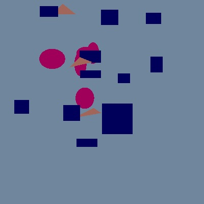
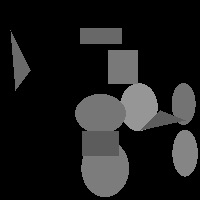
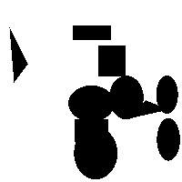

Goals
=====

Learning objectives. At the end of this lab, students should be able to:

- Add functionality to exisiting code base that draws 2D shapes (lecture project)
- Introduce Exceptions to an exisitng code base to demonstrate handling odd behavior with grace
- Add to an exisiting class (representing an image) to make it templated (able to produce either .ppm, .pgm, .pbm or .txt, including template specialization

Orientation
============

As C++ is (mostly) a strongly typed language, however there are often computations we would like to apply to various types, templates give us the ability to apply general compute to a variey of types.  

In particular, we started this quarter with a lecture project that wrote out asci files to represent shapes (remember way back then).


At this point, we are creating drawings with color data:<br>


However, we certainly can represent the same 'image' data as either a character (asci), black and white (boolean), greyscale (integer) or color (r, g, b).  Our first goal for this lab is to use templates to support these varous output types for our drawing program.

The next big idea we are playing with is that many times when our program is running things can go wrong.  We can use assert and debugging and hope our user (and other software engineers) will be well behaved, however, we can also plan to have our programs fail gracefully if all else fails.  We will do this using exceptions.  Exception design is an art that we will only just start to experiment with.  The second half of this lab involves adding exception handling for when we issues in the drawing program.

Task 1
============

Download the base code.  It is a version of our lecture code with a class to write out a color image (as we have been doing) - see image.h.
https://github.com/ucsb-cs32-w21/Lab08STARTER

You need to modify this class so that it is templated in terms of the type that the image stores.  Change all methods that operate on a 'color' to instead work on a templated type.

As we will need some methods to vary for the different types, use template specialization for the following methods (only):
```
writeHeader
writePixel
```
For the header information, see: http://paulbourke.net/dataformats/ppm/
for an example of the difference in the header for the different image types (PPM, PGM, PBM).

Modify main to test your code (test each type - see sample main) - you will also need to use template specialization in main for:
```
void createImage
```
in order to preserve the colors of shapes.

The tests that the autograder will run will be included, but in genernal, make sure you can output all four image types: color, greyscale, black and white and asci (only partial image shown due to size!). These outputs were produced with ./a.out 200 200 out






Task 2
============

Introduce exception handling for bad file and for polygon without enough vertices.


